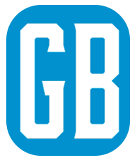

# GB Tech



## Sobre o Projeto

GB Tech é um projeto web que representa uma empresa fictícia de assistência técnica. Este projeto foi desenvolvido com HTML, CSS e JavaScript, utilizando o framework Flask para a construção do servidor e APIs RESTful.

## Estrutura do Projeto

```
GB-Tech/
├── img/
│   ├── 2logo.png
│   ├── capa.png
│   ├── logo.png
│   ├── logo2.png
│   ├── people-in-the-form-repair-service-workers-do-screen-diagnostics-and-replacement-3d-isometric-vector-illustration-design.jpg
│   ├── shape.png
│   └── tiny-tecnicos-consertando-smartphone_74855-16966.jpg
├── .gitattributes
├── README.md
├── app.js
├── index.html
└── style.css
```

### Descrição dos Arquivos e Pastas

- **img/**: Contém as imagens utilizadas no projeto, como logotipos e imagens de demonstração.
- **.gitattributes**: Arquivo do Git que define atributos para diferentes tipos de arquivo.
- **README.md**: Documentação do projeto em formato Markdown.
- **app.js**: Script JavaScript responsável por controlar as animações e interações do projeto.
- **index.html**: Página principal do projeto, contendo a estrutura HTML e os elementos visuais.
- **style.css**: Folha de estilo CSS responsável pelo design e layout do projeto.

## Como Usar

1. Clone este repositório:

   ```bash
   git clone https://github.com/seu-usuario/GB-Tech.git
   ```

2. Abra o arquivo `index.html` em um navegador web para visualizar o projeto.

## Funcionalidades

- **Menu Hambúrguer**: Ao clicar no ícone do menu hambúrguer, o menu de navegação é exibido ou ocultado.
- **Toggle Dark Mode**: Ao clicar no botão de alternância, o modo escuro é ativado ou desativado, alterando a aparência do site.

## Contribuição

Contribuições são bem-vindas! Sinta-se à vontade para abrir issues ou pull requests no repositório para sugestões de melhorias ou correções de bugs.

## Licença

Este projeto está licenciado sob a [MIT License](LICENSE).
